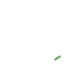
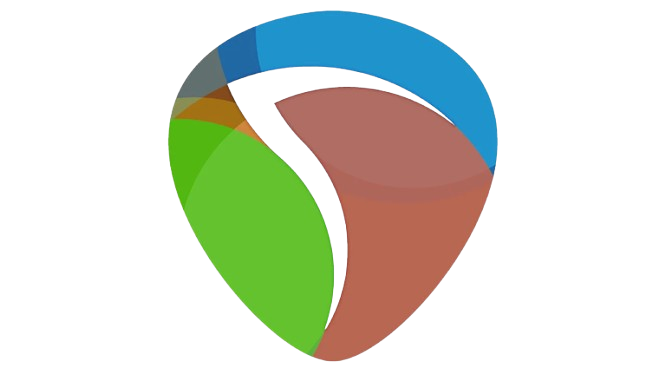

 

  
  <kbd>[STATUS]: Alive 💖 | [MODE]: Coding 💻 & Get High 🎧 | [ITEMS]: Caffeine ☕ & Cookie 🍪</kbd>

<h2>/ About Me / </h2>
<table>
<tr>
  <td valign="top">
  <h4>< Info ></h4>
  <ul>
    <li>💻 <kbd>$LEVEL$:</kbd> Junior Developer.</li>
    <li>🪑 <kbd>$ROLE$:</kbd> Game Dev, FullStack Dev, <del>Producer</del></li>
    <li>👤 <kbd>$NAME$:</kbd> Nguyen Ngoc Cuong </li>
    <li>👥 <kbd>$AGE$:</kbd> 17 </li>
    <li>🕵️ <kbd>$STUDYING$:</kbd> High school </li>
    <li>🔭 <kbd>$WORK$:</kbd> A rhythm game and a bot discord</li>
    <li>🌱 <kbd>$LEARNING$:</kbd> SvelteKit</li>
    <li>⚡ <kbd>$LIKE$:</kbd> Listening to music, playing game (especially rhythm games), watching anime ...and coding of course</li>
  </ul>
  <td align="center" valign="middle">
    
  </td>
</tr>
<tr>
  <td>
    <h4>< Qoute ></h4>
    <blockquote valign="middle">
    <i>"Imagine having more tech debt than your monthly Claude limit."</i>
    
- Nekitori17

    </blockquote>
  </td>
  <td>
    <h4>< Social ></h4>
    
     
    
    
    
    
    
    
  </td>
</tr>
</table>

  <h2>/ Skills /</h2>
  

    <kbd>
      <kbd>Front-End</kbd>
       
       
      
      
      
      
    </kbd>
    <kbd>
      <kbd>Back-end</kbd>
       
       
      
      
      
      
    </kbd>
    <kbd>
      <kbd>Database</kbd>
       
       
      
      
    </kbd>
    <kbd>
      <kbd>Language Coding</kbd>
       
       
      
      
      
      
      
      
      
    </kbd>
    <kbd>
      <kbd>Tools</kbd>
       
       
      
      
      
      <!---->
    </kbd>
    <kbd>
      <kbd>Environment / Editor</kbd>
       
       
      
      
      
      
      
    </kbd>
    </kbd>
    <kbd>
      <kbd>Creation Tools</kbd>
       
       
      
      
    </kbd>
  

<h2>/ Github Stats /</h2>
<table align="center">`
  <tr border="none">
    <td width="50%" align="center">
      
        
      
    </td>
    <td width="50%" align="center">
      
    </td>
  </tr>
</table>

 
 
<h2>/ Activities /</h2>

  
  

<footer align="center">

</footer>

